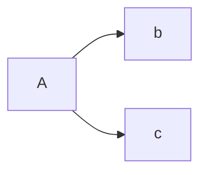
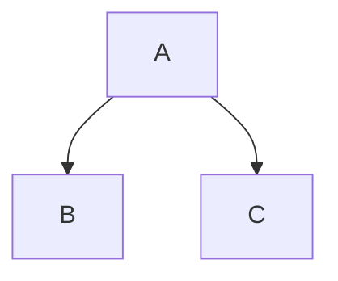
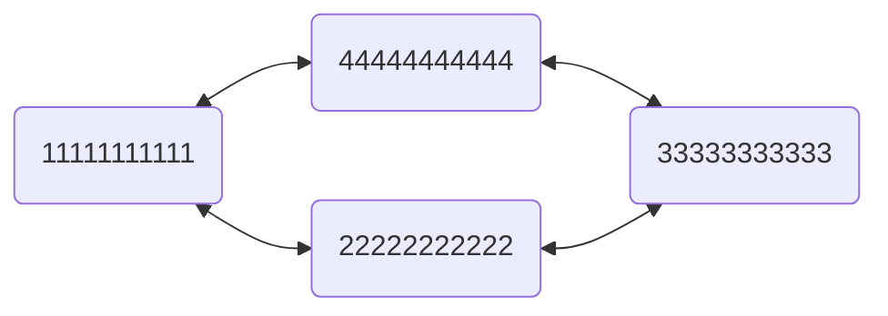
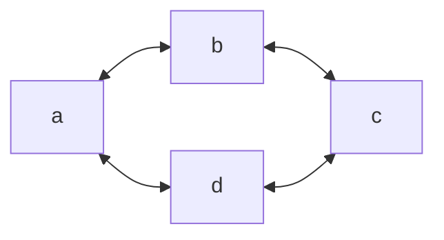
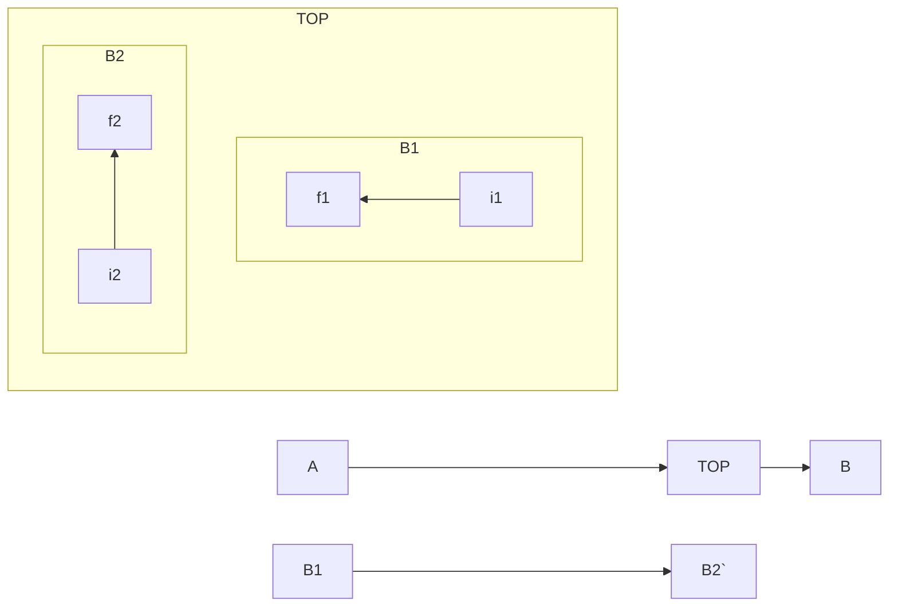
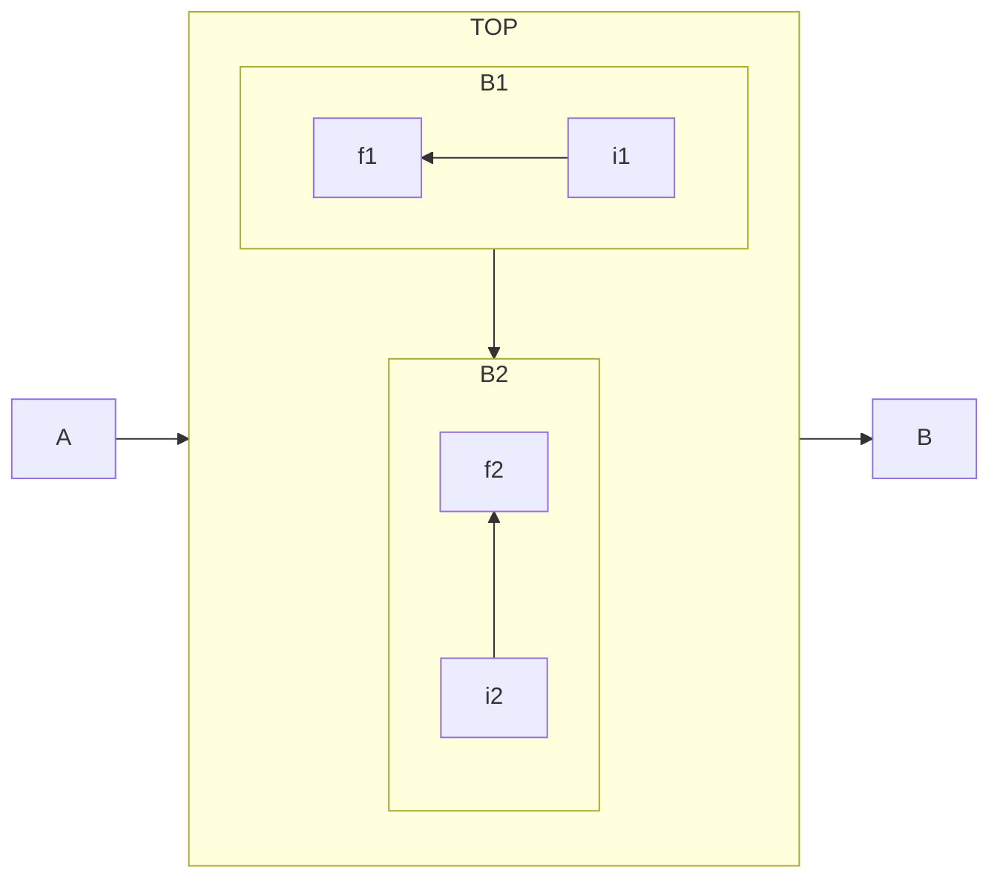

# Obsidian
 옵시디언 기록

git 을 이용할때 git workspace 를 항상 accept current 해주어야 한다.

To Do List  = Tasks
하루 할 일 = Day Planner

# 설치된 플러그인


## Tasks
할일 가져오기

-   오늘까지 완료되지 않은 항목 조회하기

````autohotkey
```tasks
not done
due today
```
Copy
````

-   마감 기한이 지나지 않고, 완료 되지 않았으며, 2주 안에 해야할 항목들 조회하기

````autohotkey
```tasks
not done
due after yesterday
due before in two weeks
```
Copy
````

-   보관함 내에 `## Tasks`라고 heading을 밑에 달아 놓은 완료된 항목들 조회하기

````autohotkey
```tasks
done
heading includes tasks
```
Copy
````

-   파일 경로 중에 `Planner` 을 포함하고 2022년 1월 20일까지 완료되지 않은 모든 항목 조회하기

`````autohotkey
```tasks
not done
due on 2022-01-20
path includes Planner
````
Copy
`````

-   오늘부터 앞으로 2주 동안 하지 않은 일, 마감일과 수정버튼 없애기

````properties
```tasks
not done
due after today
due before 2021-05-15
hide due date
hide edit button
```
Copy
````


## Day Planner

- [ ] HH:mm 해야할 일 내용

# 독서 기록 Template
독서기록 폴더에 파일생성 
-> 파일 이름을 책 이름으로 변경
-> ctrl + p
-> alt + e : Book_Report_Template 선택
주의 : 템플릿과 내가 쓰는 문자열 사이에 띄어쓰기가 한칸 있어야 한다. 서평 여부는 -와 ㅇ으로 구분한다. 


- 윈도우 가상 데스크탑 단축키
윈도우키  + tab : 가상데스크탑 작업 보기 ( 모든 가상 데스크톱 리스트, 실행프로그램, 타임라인)
윈도우키 + ctrl +  D  : 새 가상 데스크탑 열기
윈도우키 + ctrl + left : 왼쪽의 가상 데스크탑 화면으로 이동
윈도우키 + ctrl + right : 오른쪽의 가상 데스크탑 화면으로 이동
윈도우키 + ctrl + f4 : 현재의 가상 데스크탑 화면을 삭제


## Markdown 문법

- 글씨에 색 넣는 법
 <span style="color:red"> 가나다 </span>

- 글씨에 형광 넣는법
<span style="background-color:#fff5b1;">형광펜</span>

- 각주 다는 방법
[^asdf]
[^asdf] : asdfasdfasdf

- 수학적 수식 사용 방법

https://rayc20.tistory.com/151

https://velog.io/@d2h10s/LaTex-Markdown-%EC%88%98%EC%8B%9D-%EC%9E%91%EC%84%B1%EB%B2%95

예시
$$\upsilon(t) = \frac{dX(t)}{dt},\quad X(t) = X(t_0)\ + \  \int^{t_1}_{t_0}v(s)ds$$

- 조직도(organization char) 작성 방법









