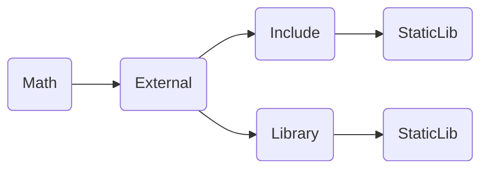
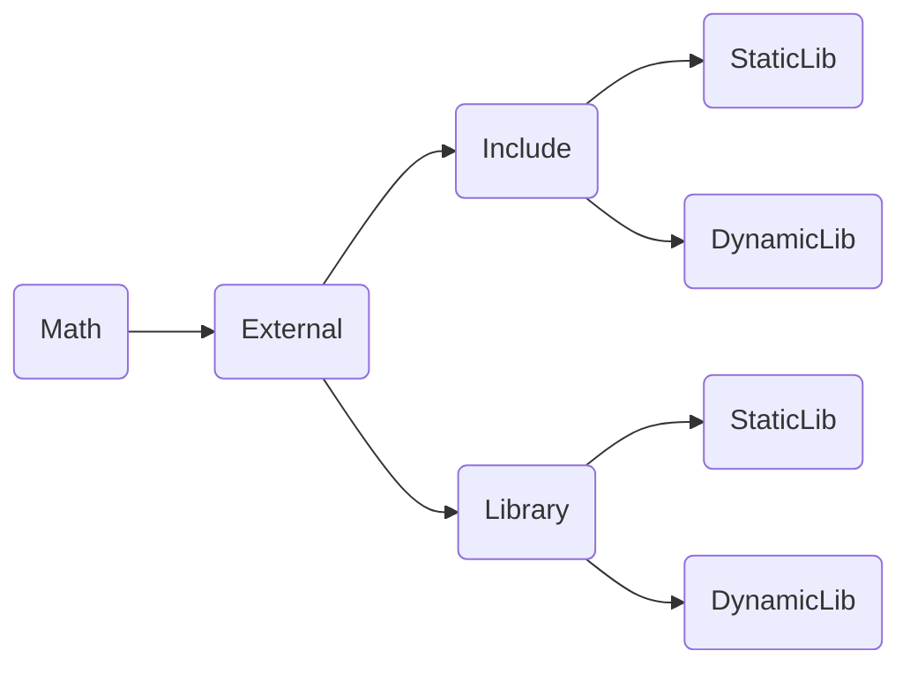
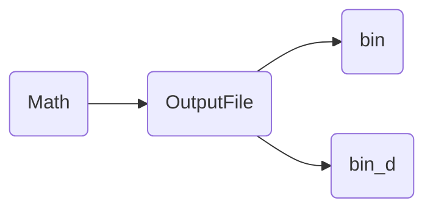

# 정적 및 동적 라이브러리 개념

라이브러리 란 특정한 코드(함수 혹은 클래스)를 포함하고 있는 컴파일된 파일이다.

1. Static Library (정적 라이브러리)
	-  프로그램 빌드 시에 라이브러리가 제공하는 코드를 실행 파일에 넣는 방식의 라이브러리.
	-  컴파일의 링킹 단계에서 실행파일 (실행 바이너리)에 결합된다(포함시킨다).
	- 라이브러리의 동작 코드가 실행 바이너리 속에 포함되어 있기 때문에 별도 추가 작업 없이, 독립적으로 라이브러리 함수들을 사용할 수 있다.

2. Dynamic Library (동적 라이브러리)
	- 컴파일시에 .lib(가져오기 라이브러리) , .dll 총 두 개의 출력 파일이 생성된다.
	- 라이브러리 전체 코드를 포함하는 static library 에서의 .lib 과는 다르게 동적 라이브러리에서 .lib 는 실제 코드를 담고 있는 것이 아니라 DLL 이 제공하고자 하는 함수정보(함수명)을 가지는 정보 파일이다.

3. 장단점
| --- | Static Lib | Dynamic LIb |
| --- | --- | --- |
| 장점 | 1. 속도가 빠르다; 2. 실행파일만 배포하면 된다.; 런타임시 외부 참조가 없다. | 1. 메인 실행 파일의 사이즈가 작다.; 2. DLL 업그레이드시 해당 모듈만 교체하고 메인 프로그램은 컴파일 하지 않아도 된다. |
| 단점 | 1. 실행 파일의 크기가 크다.; 2. 함수의 재사용성이 코드 레벨에서만 가능하다.; 3. 라이브러리가 업데이트 될 경우 다시 빌드하여 컴파일 해야 한다.; | 1. lib 에 비해 속도가 느릴 수 있다.; 2. 실행파일 배포시에는 라이브러리도 함께 배포해야 한다. |


# DOCS 정적 라이브러리 생성 및 적용

https://learn.microsoft.com/ko-kr/cpp/build/walkthrough-creating-and-using-a-static-library-cpp?view=msvc-170#CreateLibProject ^fa6970

# AK 정적 라이브러리 생성 및 적용

1. Windows 데스크톱 애플리케이션으로 프로젝트 생성 (예 : 프로젝트&솔루션 명 - Math)
2. 해당 프로젝트의 최상위 폴더(.vs 폴더 와 .sln 이 존재하는 폴더)에 External 폴더를 생성하고 그 안에 Include 폴더와 Library 폴더 생성 각 폴더에는 Static 폴더 생성 (라이브러리들의 컴파일 을 한 폴더에서 관리하기 위함)


3. 정적 라이브러리 생성 (예, MathStaticLibrary) ([[정적 및 동적 라이브러리를 프로젝트에 적용#^fa6970]]참조 + 데스크톱 프로젝트 에서 추가옵션 중 빈 프로젝트가 아니라 미리 컴파일된 헤더를 선택 (빈 프로젝트로 하는 경우 구성 속성에 C/C++ 항목이 존재 하지 않고 출력 디렉터리를 조정할 수 없음)) 
4. MathStaticLibrary -> 속성 페이지 -> 구성 = 모든 구성, 플랫폼 = x64 으로 설정 -> 일반 -> 출력 디렉터리에 idb, lib, pdb 가 생성될 경로를 지정 
```
예, $(solutionDir)External\Library\StaticLib
```
5. 4번의 과정에서 구성 = Debug 로 설정 -> 일반 -> 대상이름 에 파일 이름 지정  (release 와 debug 각각의 idb, lib, pdb 를 구별하기 위함)
```
예, $(ProjectName)_d
```
6. MathStaticLibrary 를 release, debug 버전으로 각각 빌드하면 다음과 같이 컴파일된 파일이 생성된다
![[Pasted image 20230131202028.png]]
7. StaticMath(클라이언트)에서 사용할 함수를 MathStaticLibrary에 추가(예, 사칙연산)한다.
![[Pasted image 20230131205230.png]]
```c++
//Arithmetic.h
#pragma once

namespace MathStaticLibrary
{
    class Arithmetic
    {
    public:
        // Returns a + b
        static double Add(double a, double b);

        // Returns a - b
        static double Subtract(double a, double b);

        // Returns a * b
        static double Multiply(double a, double b);

        // Returns a / b
        static double Divide(double a, double b);
    };
}
```

```c++
//Arithmeric.cpp
#include "pch.h"
#include "Arithmetic.h"

namespace MathStaticLibrary
{
    double Arithmetic::Add(double a, double b)
    {
        return a + b;
    }

    double Arithmetic::Subtract(double a, double b)
    {
        return a - b;
    }

    double Arithmetic::Multiply(double a, double b)
    {
        return a * b;
    }

    double Arithmetic::Divide(double a, double b)
    {
        return a / b;
    }
}
```
9. Math(클라이언트)의 속성->링커->일반->추가 라이브러리 디렉터리에 경로 추가
```c++
$(SolutionDir)External\Library
```
11. Arithmetic.h를 External->Include->StaticLib 폴더에 복사
12. Math.cpp 에서
```c++
#include <복사한 Arithmetic.h경로>
#pragma comment(lib, "정적라이브러리의 디버그.lib 경로")
(여기에서 정적 라이브러리의 디버그.lib 경로는 9. 에서 설정된 경로 이후를 적으면 된다.)
예,
#include <StaticLib\Arithmetic.h>
#pragma comment(lib, "Static//MathStaticLibrary_d.lib")
```
13. 솔루션 속성 -> 공용속성 -> 프로젝트 종속성 -> 다음에 종속-> 사용하고 자 하는 라이브러리 체크 ![[Pasted image 20230201115402.png]]
15. 프로젝트의 메인함수에서 정적 라이브러리의 함수 사용
```c++
// Math.cpp
#include "framework.h"
#include "Math.h"

#include<StaticLib/Arithmetic.h>

#ifdef _DEBUG
#pragma comment(lib, "StaticLib//MathStaticLibrary_d.lib")
#else
#pragma comment(lib, "StaticLib//MathStaticLibrary.lib")
#endif

...

int APIENTRY wWinMain(_In_ HINSTANCE hInstance,
                     _In_opt_ HINSTANCE hPrevInstance,
                     _In_ LPWSTR    lpCmdLine,
                     _In_ int       nCmdShow)
{
    UNREFERENCED_PARAMETER(hPrevInstance);
    UNREFERENCED_PARAMETER(lpCmdLine);

    // TODO: 여기에 코드를 입력합니다.

    double a = 7.4;
    double b = 9.9;
    double c = 0.0;

    c = MathLibrary::Arithmetic::Add(a, b); // 여기에 중단점을 걸고 확인
    c = MathLibrary::Arithmetic::Subtract(a, b);
    c = MathLibrary::Arithmetic::Multiply(a, b);
    c = MathLibrary::Arithmetic::Divide(a, b);
...
	return (int)msg.wParam;
}

```

# DOCS 동적 라이브러리 생성 및 적용

https://learn.microsoft.com/ko-kr/cpp/build/walkthrough-creating-and-using-a-dynamic-link-library-cpp?view=msvc-170
# AK 동적 라이브러리 생성 및 적용

- 동적 라이브러리는 빌드를 할 경우 .lib , .dll 두 유형이 나와야 한다. 
- 함수의 export 처리 : 동적 라이브러리는 특성상 링크를 걸어 사용해야 하기 때문에 가지고 있는 함수 중에 어떤 것은 사용하고 어떤 것은 사용하지 않는다. 따라서 함수별로 export 할 것인지에 대해 설정 값을 부여해 주어야 한다. -> 공개 처리 마킹 되어 있는 함수만 사용이 가능하다. -> export 하지 않으면 .lib 파일은 나오지 않는다.

1. Include 와 External 폴더에 DynamicLab 폴더 생성

2. Math 솔루션에 동적 라이브러리 (예, MathDynamicLibrary) 생성
3. 동적 라이브러리 (MathDynamicLibrary)의 속성-> 구성 = 모든 구성 -> 일반 -> 출력 디렉터리를 위의 조직도의 Library->DynamicLib 폴더로 지정
```c++
$(SolutionDir)External\Library\DynamicLib\
```
4. 구성 = dedug 일때 대상이름에 다음을 입력
```c++
$(ProjectName)_d
```
5. MathDynamicLibrary 에 사칙연산 함수 추가
![[Pasted image 20230201105832.png]]
```c++
// Arithmetic_dll.h
#pragma once

#ifdef MATHDYNAMICLIBRARY_EXPORTS
#define DLL extern "C" __declspec(dllexport)
#else
#define DLL extern "C" __declspec(dllimport)
#endif

// Returns a + b
DLL double Add_dll(double a, double b);

// Returns a - b
DLL double Subtract_dll(double a, double b);

// Returns a * b
DLL double Multiply_dlldouble a, double b);

// Returns a / b
DLL double Divide_dll(double a, double b);
```
	위의 Arithmetic_dll.h 에서
	1. extern "C" - 관용적으로 쓰이며, 작성한 함수가 C++뿐만 아니라 C 에서도 사용이 가능하다는 뜻
	2. declspec(dllexport) - 동적 라이브러리 빌드 시 .lib 파일 생성
	3. DLL - 함수의 export 처리 - 동적 라이브러리는 특성상 링크를 설어 사용해야 하기 때문에 가지고 있는 함수 중에서 어떤 것은 쓰고 어떤 것은 사용하지 않는다. 따라서 함수별로 export 할 것인지에 대해 설정 값을 넣어주어야한다. -> 공개 처리 마킹 되어있는 함수만 사용하능 하다. -> Export 하지 않으면 .lib 파일은 생성되지 않는다.

```c++
// Arithmetic_dll.cpp
#include "pch.h"
#include "Arithmetic_dll.h"

double Add_dll(double a, double b)
{
	return a + b;
}

double Subtract_dll(double a, double b)
{
	return a - b;
}

double Multiply_dll(double a, double b)
{
	return a * b;
}

double Divide_dll(double a, double b)
{
	return a / b;
}
```

6. MathStaticLibrary 를 release, debug 버전으로 각각 빌드하면 다음과 같이 컴파일된 파일이 생성된다. 동적 라이브러리는 빌드 시에 .lib 파일과 .dll 파일이 동시에 생성되어야 한다.
![[Pasted image 20230201110047.png]]
(정적 라이브러리에서는 빌드를 먼저하고 그 다음 Arithmetic 를 생성했지만 동적 라이브러리 에서는 Arithmetic_dll 을 먼저 생성하고 빌드하였다. -> Arithmeric_dll.h 에서 __decplspec(dllexport) 와 DLL 매크로가 붙은 정의가 있어야 빌드 시에 .lib 파일이 생기기 때문.)

### 암시적 링킹(Implicit Linking)

1. 실행 파일(.exe)자체에 DLL 의 함수 정보를 포함시키는 방식. 따라서 프로젝트가 시작될 때 모조건 링크를 걸고 프로젝트가 종료되면 링크를 끊는다. 
2. 해당 파일을 include 하고 동적 라이브러리 lib 파일을 pragma comment 한다. 
3. 실행파일과 .lib 파일이 연결되어야 한다. 
4. 참조하는 동적 라이브러리 헤더파일은 수정될 때마다 include 폴더의 파일과 dll 파일을 최신으로 덮어쓰기 해주어야 한다.

##### 암시적 링킹 적용

1. 실행 파일 폴더 생성

2. 프로젝트 속성-> 구성 = Debug -> 구성 속성 -> 일반 -> 출력 디렉터리 에 다음과 같이 입력
```c++
$(SolutionDir)OutputFile\bin_d\
```
3. 프로젝트 속성-> 구성 = Release -> 구성 속성 -> 일반 -> 출력 디렉터리 에 다음과 같이 입력
```c++
$(SolutionDir)OutputFile\bin\
```
5. External -> Library->DynamicLib 의 
```c++
(동적 라이브러리 명).dll 파일 과 (동적 라이브러리명)_d.dll
```
을 각각bin 와 bin_d에 복사한다. -> 이것을 빌드할 때마다 해주어야 하므로 빌드 후 이벤트로 자동화 시킨다.  동적 라이브러리 속성 -> 빌드 이벤트 -> 빌드 후 이벤트 -> 명령줄에 다음 입력
```c++
copy "$(TargetDir)MathDynamicLibrary_d.dll" "$(SolutionDir)OutputFile\bin_d"
copy "$(TargetDir)MathDynamicLibrary.dll" "$(SolutionDir)OutputFile\bin"
// copy "$(TargetDir)복사할 프로젝트명.dll" "복사하고 싶은 위치"
```
이후 빌드하면 bin 과 bin_d 폴더에 그에 맞는 .dll 파일이 복사되어 있다.
5. 프로젝트의 Math.cpp 에서 동적 라이브러리 함수 사용
```c++
// Math.cpp
#include "framework.h"
#include "Math.h"

#include <DynamicLib\Arithmetic_dll.h>

#ifdef _DEBUG
#pragma comment(lib, "DynamicLib//MathDynamicLibrary_d.lib")
#else
#pragma comment(lib, "DynamicLib//MathDynamicLibrary.lib")
#endif

...

int APIENTRY wWinMain(_In_ HINSTANCE hInstance,
                     _In_opt_ HINSTANCE hPrevInstance,
                     _In_ LPWSTR    lpCmdLine,
                     _In_ int       nCmdShow)
{
    UNREFERENCED_PARAMETER(hPrevInstance);
    UNREFERENCED_PARAMETER(lpCmdLine);

    // TODO: 여기에 코드를 입력합니다.

    double a = 7.4;
    double b = 9.9;
    double c = 0.0;

    c = Add_dll(a, b); // 여기에 중단점 걸고 확인
    c = Subtract_dll(a, b);
    c = Multiply_dll(a, b);
    c = Divide_dll(a, b);
...
	return (int)msg.wParam;
}
```

### 명시적 링킹 (Explicit Linking)
런타임 중 특정 DLL 을 로드하여 호출할 함수의 포인터를 얻어 함수를 호출하는 링크 방식.

##### 명시적 링킹 적용

1. 위의 암시적 링킹 1~4 까지 동일
2. 프로젝트의 Math.cpp 에서 동적 라이브러리 함수 사용
```c++
// Math.cpp
#include "framework.h"
#include "Math.h"

//#include <DynamicLib\Arithmetic_dll.h> //...1

#ifdef _DEBUG
#pragma comment(lib, "DynamicLib//MathDynamicLibrary_d.lib")
#else
#pragma comment(lib, "DynamicLib//MathDynamicLibrary.lib")
#endif

typedef double (*DLL_Arithmetic)(double a, double b); //...2

...

int APIENTRY wWinMain(_In_ HINSTANCE hInstance,
                     _In_opt_ HINSTANCE hPrevInstance,
                     _In_ LPWSTR    lpCmdLine,
                     _In_ int       nCmdShow)
{
    UNREFERENCED_PARAMETER(hPrevInstance);
    UNREFERENCED_PARAMETER(lpCmdLine);

    // TODO: 여기에 코드를 입력합니다.
	// ...3
	
    double a = 7.4;
    double b = 9.9;
    double c = 0.0;
    
    HMODULE hModule = ::LoadLibrary(L"..//bin_d//MathDynamicLibrary_d.dll");
	if(hModule != NULL)
	{
	    DLL_Arithmetic Add_dll_Explicit = 
		    (DLL_Arithmetic)GetProcAddress(hModule, "Add_dll");
	    DLL_Arithmetic Subtract_dll_Explicit = 
		    (DLL_Arithmetic)GetProcAddress(hModule, "Subtract_dll");
	    DLL_Arithmetic Multiply_dll_Explicit = 
		    (DLL_Arithmetic)GetProcAddress(hModule, "Multiply_dll");
	    DLL_Arithmetic Divide_dll_Explicit = 
		    (DLL_Arithmetic)GetProcAddress(hModule, "Divide_dll");
		
		c = Add_dll_Explicit(a, b); // 여기에 중단점 걸고 확인
	    c = Subtract_dll_Explicit(a, b);
	    c = Multiply_dll_Explicit(a, b);
	    c = Divide_dll_Explicit(a, b);

		::FreeLibrary(hModule);
	}
	
	...
	
	return (int)msg.wParam;
}
```
3. 위의 코드에서
	1. Arithmetic_dll.h 파일을 include 하는 부분이 주석처리 되어 있다. 명시적 링킹에서는 import 선언이 필요하지 않다.
	2. 명시적 링크는 함수 포인터를 받아 호출하는 방식이기 때문에 호출하려는 함수의 원형을 함수 포인터 형태로 선언해야 한다. 따라서 typedef 키워드를 사용하여 함수포인터 형태를 선언해 준다.
	3. LoadLibrary( ) 함수를 호출하여 특정 경로의 DLL 을 불러온다. 해당 DLL의 핸들은 HMODULE 으로 반환된다. 정상적으로 못불러오는 경우 NULL 이 반환된다.
	4. NULL 체크 이후 GetProcAddress( )함수를 호출하여, DLL 핸들에서 특정 함수 이름의 함수 포인터를 반환한다. 즉, 이 함수 포인터를 호출하면 DLL 핸들에서 특정 함수를 호출하게 되는 것이다.
	5. 더 이상 DLL 을 사용하지 않는다면 FreeLibrary( )함수를 호출하여 DLL 핸들을 해제한다.

4. 명시적 링킹 사용 이유
	1. 프로세스 시작 시 DLL 을 찾을 수 없으면 운영체제에서 암시적 링킹을 사용하는 프로세스를 종료한다. 명시적 링킹을 사용하는 프로세스는 이 상황에서 종료되지 않으며 오류로부터 복구를 시도할 수 있다.
	2. 연결된 DLL 중 하나라도 실패하는 DllMain 함수가 있는 경우에는 암시적 링킹을 사용하는 프로세스도 종료된다. 명시적 링킹을 사용하는 프로세스는 이 상황에서 종료되지 않는다.
	3. 암시적 링킹로 된 DLL 이 많은 애플리케이션의 경우 시작하는 속도가 느릴 수 있다. 명시적 링킹의 경우 필요한 경우에만 DLL 을 Load 한다.


# Reference

- 정적 라이브러리
https://learn.microsoft.com/ko-kr/cpp/build/walkthrough-creating-and-using-a-static-library-cpp?view=msvc-170#CreateLibProject
- 동적 라이즈러리
https://learn.microsoft.com/en-us/cpp/build/walkthrough-creating-and-using-a-dynamic-link-library-cpp?redirectedfrom=MSDN&view=msvc-170
- 빌드
https://learn.microsoft.com/ko-kr/cpp/build/reference/building-an-import-library-and-export-file?view=msvc-170
- 프로젝트 참조 관리
https://learn.microsoft.com/ko-kr/visualstudio/ide/managing-references-in-a-project?view=vs-2022
- 암시적 링크, 명시적 링크
https://learn.microsoft.com/en-us/cpp/build/linking-an-executable-to-a-dll?view=msvc-170
- 빌드 후 이벤트
https://olsh1108o.tistory.com/entry/C-%EB%B9%8C%EB%93%9C-%ED%9B%84-%EC%9D%B4%EB%B2%A4%ED%8A%B8-%EB%AA%85%EB%A0%B9%EC%96%B4%EB%A1%9C-DLL%ED%8C%8C%EC%9D%BC-%EB%B3%B5%EC%82%AC%ED%95%98%EA%B8%B0
- 심화
https://yonghello.tistory.com/entry/Dll%EC%9D%B4%EB%9E%80