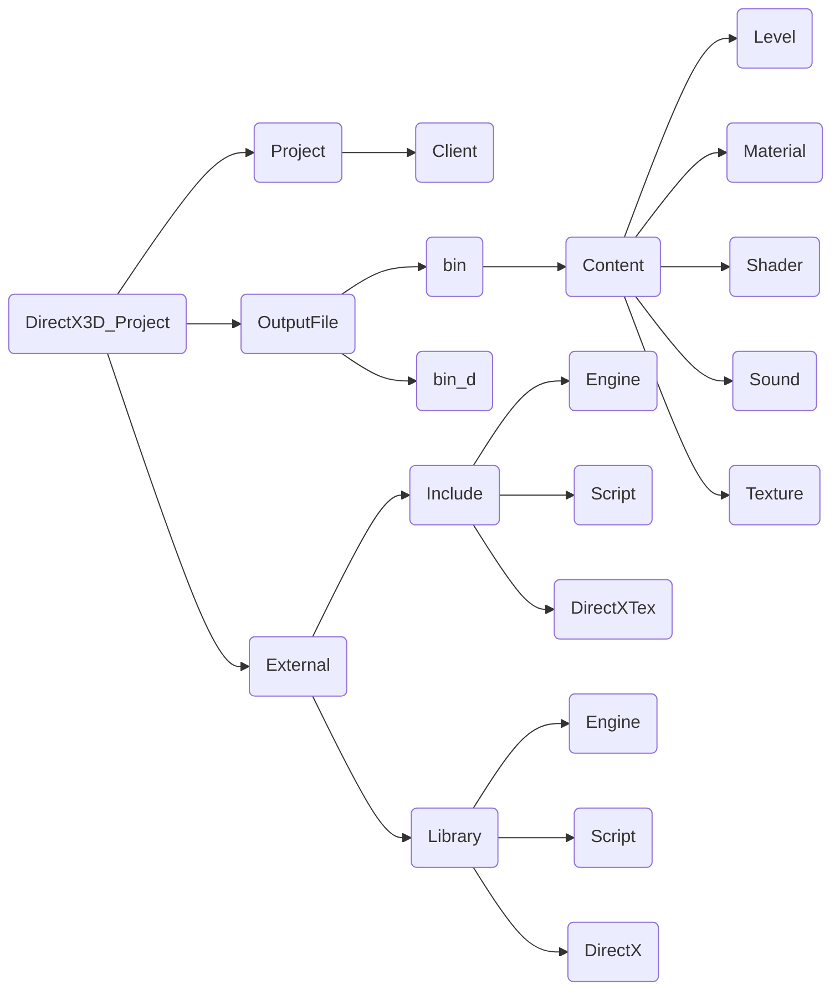

## Project Init

1.  git repository 추가 및 clone (open with GitHub Desktop)
![[Pasted image 20231211114917.png]]

- gitignore
```.gitignore
# Created by https://www.toptal.com/developers/gitignore/api/windows,visualstudio,c++
# Edit at https://www.toptal.com/developers/gitignore?templates=windows,visualstudio,c++

### C++ ###
# Prerequisites
*.d

# Compiled Object files
*.slo
*.lo
*.o
*.obj

# Precompiled Headers
*.gch
*.pch

# Compiled Dynamic libraries
*.so
*.dylib
*.dll

# Fortran module files
*.mod
*.smod

# Compiled Static libraries
*.lai
*.la
*.a
*.lib

# Executables
*.exe
*.out
*.app

##files
*.sln
**/*.vcxproj
**/*.vcxproj.*
**/*.i
**/*.obj

### Windows ###
# Windows thumbnail cache files
Thumbs.db
Thumbs.db:encryptable
ehthumbs.db
ehthumbs_vista.db

# Dump file
*.stackdump

# Folder config file
[Dd]esktop.ini

# Recycle Bin used on file shares
$RECYCLE.BIN/

# Windows Installer files
*.cab
*.msi
*.msix
*.msm
*.msp

# Windows shortcuts
*.lnk

### VisualStudio ###
## Ignore Visual Studio temporary files, build results, and
## files generated by popular Visual Studio add-ons.
##
## Get latest from https://github.com/github/gitignore/blob/main/VisualStudio.gitignore

# User-specific files
*.rsuser
*.suo
*.user
*.userosscache
*.sln.docstates

# User-specific files (MonoDevelop/Xamarin Studio)
*.userprefs

# Mono auto generated files
mono_crash.*

# Build results
[Dd]ebug/
[Dd]ebugPublic/
[Rr]elease/
[Rr]eleases/
x64/
x86/
[Ww][Ii][Nn]32/
[Aa][Rr][Mm]/
[Aa][Rr][Mm]64/
bld/
[Bb]in/
[Oo]bj/
[Ll]og/
[Ll]ogs/

# Visual Studio 2015/2017 cache/options directory
.vs/
# Uncomment if you have tasks that create the project's static files in wwwroot
#wwwroot/

# Visual Studio 2017 auto generated files
Generated\ Files/

# MSTest test Results
[Tt]est[Rr]esult*/
[Bb]uild[Ll]og.*

# NUnit
*.VisualState.xml
TestResult.xml
nunit-*.xml

# Build Results of an ATL Project
[Dd]ebugPS/
[Rr]eleasePS/
dlldata.c

# Benchmark Results
BenchmarkDotNet.Artifacts/

# .NET Core
project.lock.json
project.fragment.lock.json
artifacts/

# ASP.NET Scaffolding
ScaffoldingReadMe.txt

# StyleCop
StyleCopReport.xml

# Files built by Visual Studio
*_i.c
*_p.c
*_h.h
*.ilk
*.meta
*.iobj
*.pdb
*.ipdb
*.pgc
*.pgd
*.rsp
*.sbr
*.tlb
*.tli
*.tlh
*.tmp
*.tmp_proj
*_wpftmp.csproj
*.log
*.tlog
*.vspscc
*.vssscc
.builds
*.pidb
*.svclog
*.scc

# Chutzpah Test files
_Chutzpah*

# Visual C++ cache files
ipch/
*.aps
*.ncb
*.opendb
*.opensdf
*.sdf
*.cachefile
*.VC.db
*.VC.VC.opendb

# Visual Studio profiler
*.psess
*.vsp
*.vspx
*.sap

# Visual Studio Trace Files
*.e2e

# TFS 2012 Local Workspace
$tf/

# Guidance Automation Toolkit
*.gpState

# ReSharper is a .NET coding add-in
_ReSharper*/
*.[Rr]e[Ss]harper
*.DotSettings.user

# TeamCity is a build add-in
_TeamCity*

# DotCover is a Code Coverage Tool
*.dotCover

# AxoCover is a Code Coverage Tool
.axoCover/*
!.axoCover/settings.json

# Coverlet is a free, cross platform Code Coverage Tool
coverage*.json
coverage*.xml
coverage*.info

# Visual Studio code coverage results
*.coverage
*.coveragexml

# NCrunch
_NCrunch_*
.*crunch*.local.xml
nCrunchTemp_*

# MightyMoose
*.mm.*
AutoTest.Net/

# Web workbench (sass)
.sass-cache/

# Installshield output folder
[Ee]xpress/

# DocProject is a documentation generator add-in
DocProject/buildhelp/
DocProject/Help/*.HxT
DocProject/Help/*.HxC
DocProject/Help/*.hhc
DocProject/Help/*.hhk
DocProject/Help/*.hhp
DocProject/Help/Html2
DocProject/Help/html

# Click-Once directory
publish/

# Publish Web Output
*.[Pp]ublish.xml
*.azurePubxml
# Note: Comment the next line if you want to checkin your web deploy settings,
# but database connection strings (with potential passwords) will be unencrypted
*.pubxml
*.publishproj

# Microsoft Azure Web App publish settings. Comment the next line if you want to
# checkin your Azure Web App publish settings, but sensitive information contained
# in these scripts will be unencrypted
PublishScripts/

# NuGet Packages
*.nupkg
# NuGet Symbol Packages
*.snupkg
# The packages folder can be ignored because of Package Restore
**/[Pp]ackages/*
# except build/, which is used as an MSBuild target.
!**/[Pp]ackages/build/
# Uncomment if necessary however generally it will be regenerated when needed
#!**/[Pp]ackages/repositories.config
# NuGet v3's project.json files produces more ignorable files
*.nuget.props
*.nuget.targets

# Microsoft Azure Build Output
csx/
*.build.csdef

# Microsoft Azure Emulator
ecf/
rcf/

# Windows Store app package directories and files
AppPackages/
BundleArtifacts/
Package.StoreAssociation.xml
_pkginfo.txt
*.appx
*.appxbundle
*.appxupload

# Visual Studio cache files
# files ending in .cache can be ignored
*.[Cc]ache
# but keep track of directories ending in .cache
!?*.[Cc]ache/

# Others
ClientBin/
~$*
*~
*.dbmdl
*.dbproj.schemaview
*.jfm
*.pfx
*.publishsettings
orleans.codegen.cs

# Including strong name files can present a security risk
# (https://github.com/github/gitignore/pull/2483#issue-259490424)
#*.snk

# Since there are multiple workflows, uncomment next line to ignore bower_components
# (https://github.com/github/gitignore/pull/1529#issuecomment-104372622)
#bower_components/

# RIA/Silverlight projects
Generated_Code/

# Backup & report files from converting an old project file
# to a newer Visual Studio version. Backup files are not needed,
# because we have git ;-)
_UpgradeReport_Files/
Backup*/
UpgradeLog*.XML
UpgradeLog*.htm
ServiceFabricBackup/
*.rptproj.bak

# SQL Server files
*.mdf
*.ldf
*.ndf

# Business Intelligence projects
*.rdl.data
*.bim.layout
*.bim_*.settings
*.rptproj.rsuser
*- [Bb]ackup.rdl
*- [Bb]ackup ([0-9]).rdl
*- [Bb]ackup ([0-9][0-9]).rdl

# Microsoft Fakes
FakesAssemblies/

# GhostDoc plugin setting file
*.GhostDoc.xml

# Node.js Tools for Visual Studio
.ntvs_analysis.dat
node_modules/

# Visual Studio 6 build log
*.plg

# Visual Studio 6 workspace options file
*.opt

# Visual Studio 6 auto-generated workspace file (contains which files were open etc.)
*.vbw

# Visual Studio 6 auto-generated project file (contains which files were open etc.)
*.vbp

# Visual Studio 6 workspace and project file (working project files containing files to include in project)
*.dsw
*.dsp

# Visual Studio 6 technical files

# Visual Studio LightSwitch build output
**/*.HTMLClient/GeneratedArtifacts
**/*.DesktopClient/GeneratedArtifacts
**/*.DesktopClient/ModelManifest.xml
**/*.Server/GeneratedArtifacts
**/*.Server/ModelManifest.xml
_Pvt_Extensions

# Paket dependency manager
.paket/paket.exe
paket-files/

# FAKE - F# Make
.fake/

# CodeRush personal settings
.cr/personal

# Python Tools for Visual Studio (PTVS)
__pycache__/
*.pyc

# Cake - Uncomment if you are using it
# tools/**
# !tools/packages.config

# Tabs Studio
*.tss

# Telerik's JustMock configuration file
*.jmconfig

# BizTalk build output
*.btp.cs
*.btm.cs
*.odx.cs
*.xsd.cs

# OpenCover UI analysis results
OpenCover/

# Azure Stream Analytics local run output
ASALocalRun/

# MSBuild Binary and Structured Log
*.binlog

# NVidia Nsight GPU debugger configuration file
*.nvuser

# MFractors (Xamarin productivity tool) working folder
.mfractor/

# Local History for Visual Studio
.localhistory/

# Visual Studio History (VSHistory) files
.vshistory/

# BeatPulse healthcheck temp database
healthchecksdb

# Backup folder for Package Reference Convert tool in Visual Studio 2017
MigrationBackup/

# Ionide (cross platform F# VS Code tools) working folder
.ionide/

# Fody - auto-generated XML schema
FodyWeavers.xsd

# VS Code files for those working on multiple tools
.vscode/*
!.vscode/settings.json
!.vscode/tasks.json
!.vscode/launch.json
!.vscode/extensions.json
*.code-workspace

# Local History for Visual Studio Code
.history/

# Windows Installer files from build outputs

# JetBrains Rider
*.sln.iml

### VisualStudio Patch ###
# Additional files built by Visual Studio

# End of https://www.toptal.com/developers/gitignore/api/windows,visualstudio,c++
```

2. clone 한 로컬 폴더에 프로젝트 생성
   1. visual code 의 새 프로젝트 만들기
   2. Window 데스크톱 애플리케이션 선택
   3. 다음의 구조로 폴더 추가 및 Client 이동
      Client 를 이동시켰으므로 .sln 폴더를 메모장으로 켜서 vcxproj 경로를 수정해줘야 한다.


3.  Client 속성 설정
	1. 모든 구성, VC++ 디렉터리, 일반
		1. 포함 디렉터리, $(SolutionDir)External\\Include\\;\$(IncludePath)
		2. 라이브러리 디렉터리, \$(SolutionDir)External\\Library\\;$(LibraryPath)
	2. 모든 구성, 디버깅, 작업 디렉터리, \$(SolutionDir)\\OutputFile\\bin\\
	3. 구성(Debug), 일반, 출력 디렉터리 : \$(SolutionDir)OutputFile\\bin_d\\
	4. 구성(Release), 일반, 출력 디렉터리 : \$(SolutionDir)OutputFile\\bin\\

4. Engine, Script 프로젝트 추가
	1. 솔루션 'DirectX3D_Project' -> 추가 -> 새 프로젝트
		- 새 프로젝트 구성, 프로젝트 이름 : Engine, 위치 ; 위 mermaid 에서 Project 폴더
		- Engine 프로젝트 -> 속성 
			- 모든 구성, 일반, 출력 디렉터리 : \$(SolutionDir)Exteranal\\Library\\Engine\\
			- 구성(Debug), 일반, 대상 이름 : \$(Projectname)\_d
			- 구성(Release), 일반, 대상 이름 : \$(Projectname)
			- 모든 구성, 디버깅, 작업 디렉터리 : \$(SolutionDir)\\OutputFile\\bin\\
			- 모든 구성, VC++ 디렉터리, 일반, 포함 디렉터리 : \$(SolutionDir)External\\Include\\;$(IncludePath), 라이브러리 디렉터리 : \$(SolutionDir)External\\Library\\;\$(LibraryPath)
	2. 솔루션 'DirectX3D_Project' -> 추가 -> 새 프로젝트
		- 새 프로젝트 구성, 프로젝트 이름 : Script, 위치 ; 위 mermaid 에서 Project 폴더
		- Script 프로젝트 -> 속성
			- 모든 구성, 일반, 출력 디렉터리 : \$(SolutionDir)Exteranal\\Library\\Script\\
			- 구성(Debug), 일반, 대상 이름 : \$(Projectname)\_d
			- 구성(Release), 일반, 대상 이름 : \$(Projectname)
			- 모든 구성, VC++ 디렉터리, 일반, 포함 디렉터리 : \$(SolutionDir)External\\Include\\;$(IncludePath), 라이브러리 디렉터리 : \$(SolutionDir)External\\Library\\;\$(LibraryPath), 외부 include 디렉터리 : $(ExternalIncludePath)

5. 배치 파일 추가
Client 프로젝트에서 Engine 과 Script 의 헤더파일에 쉽게 접근하기 위해서 두 프로젝트의 헤더파일을 External/Include 폴더에 넣어 두는 것이다.
	- 배치 파일 생성 .sln 파일이 있는 폴더에 메모장으로 다음을 입력하고 EngineCopy.bat 으로 저장
```c++
xcopy /s /y  /exclude:exclude_list.txt ".\Project\Engine\*.h" ".\External\Include\Engine"
xcopy /s /y  /exclude:exclude_list.txt ".\Project\Engine\*.fx" ".\OutputFile\bin\content\shader"
```
\\
	- Engine 프로젝트 -> 속성, 모든 구성, 빌드 이벤트 -> 빌드 전 이벤트 -> 명령줄 -> 편집 에 다음을 입력
```c++
cd $(SolutionDir)
call EngineCopy.bat
```
\* 이때 반드시 줄바꿈을 할 것 (cd 명령어와 call 명령어 분리)
\\
	- 배치 파일 생성 .sln 파일이 있는 폴더에 메모장으로 다음을 입력하고 ScriptCopy.bat 으로 저장
```c++
xcopy /s /y  /exclude:exclude_list.txt ".\Project\Script\*.h" ".\External\Include\Script"
```
\\
	-  Script 프로젝트 -> 속성, 모든 구성, 빌드 이벤트 -> 빌드 전 이벤트 -> 명령줄 -> 편집 에 다음을 입력
```c++
cd $(SolutionDir)
call ScriptCopy.bat
```
\\
	- 배치파일로 헤더파일을 옮길 때 제외할 헤더 파일 명단을 txt 로 저장. 다음을 .sln 파일이 있는 폴더에 exclude_list.txt 로 저장한다.
```txt
targetver.h
pch.h
framework.h
```

6. DirectXTex 추가
	1. Include 폴더 와 Library 폴더에 DirectXTex 추가
	2. https://github.com/microsoft/DirectXTex 에서 Zip Download
	3. 다운 받은 파일을 풀고 DirectXTex-mian 폴더의 DirectXTex_Desktop_2022_Win10.sln 실행
	4. VS 에서 debug, release 로 각각 빌드
	5. Include -> DirectXTex 에 DirectXTex-main -> DirectXTex 의 DirectXTex.h 와 DirectXTex.inl 을 복사
	6. DirectXTex-main\DirectXTex-main\DirectXTex\Bin\Desktop_2022_Win10\x64\ Debug 폴더에 있는 DirectXTex.lib 를 DirectXTex_d.lib 로 이름 변경 후  Library -> DirectXTex 에 복사
	7. DirectXTex-main\DirectXTex-main\DirectXTex\Bin\Desktop_2022_Win10\x64\ Release 폴더에 있는 DirectXTex.lib 를  Library -> DirectXTex 에 복사

7. Client 프로젝트 pch.h ,cpp 추가
Client -> 속성 -> C++ -> 미리 컴파일된 헤더 -> 사용
pch.cpp -> 속성 -> C++ -> 미리 컴파일된 헤더 -> 만들기
```c++
// pch.h
#pragma once

#include "framework.h"

// Engine Library
#ifdef _DEBUG
#pragma comment(lib, "Engine//Engine_d")
#else
#pragma comment(lib, "Engine//Engine")
#endif

// Script Library
#ifdef _DEBUG
#pragma comment(lib, "Script//Script_d")
#else
#pragma comment(lib, "Script//Script")
#endif

// pch.cpp
#include "pch.h"
```

8. Client.cpp 를 main.cpp 로 이름 변경

9. 프로젝트 구조 변경
다음의 구조로 폴더 구조 변경 및 .h 와 .cpp 파일 이동
![[Pasted image 20231212182644.png]]

10.  main.cpp의 구조 변경
\	1. 기본 메시지 루프 부분의 GetMessage 구조 를 PeekMessage 구조로 변경
```c++
 while (true)
    {
        if (PeekMessage(&msg, nullptr, 0, 0, PM_REMOVE))
        {
            if (WM_QUIT == msg.message)
                break;

            if (!TranslateAccelerator(msg.hwnd, hAccelTable, &msg))
            {
                TranslateMessage(&msg);
                DispatchMessage(&msg);
            }
        }
        else
        {
            // 프로그램 진행
        }
    }
```
\	2. wWinMain() 에서
		- hPrevInstance 와 lpCmdLine 에 대한 UNREFERENCED_PARAMETER 를 삭제
		- 전역 문자역 초기화 삭제
		- CreateWindowW() 의 인자인 szWindowClass 와 szTitle 을 하드 코딩으로 변경
	3. /#include \<crtdbg.h> 후 wWinMain() 에 \_CrtSetDbgFlag(\_CRTDBG_ALLOC_MEM_DF | \_CRTDBG_LEAK_CHECK_DF);  추가
	4. MyRegisterClass() 의 wcex.lpzsclassName 에 CreateWindowW() 의 OL 인자 위치의 하드 코딩을 똑같이 하드코딩으로 대입
	5. 전역변수로 윈도우 핸들을 선언 (HWND g_hWnd; )하고 해당 전역 변수에 CreateWindowW() 의 반환값을 저장
```c++
BOOL InitInstance(HINSTANCE hInstance, int nCmdShow)
{
   hInst = hInstance; // 인스턴스 핸들을 전역 변수에 저장합니다.

   g_hWnd = CreateWindowW(L"Project_Window", L"DirectX_Project", WS_OVERLAPPEDWINDOW,
      CW_USEDEFAULT, 0, CW_USEDEFAULT, 0, nullptr, nullptr, hInstance, nullptr);

   if (!g_hWnd)
   {
      return FALSE;
   }

   ShowWindow(g_hWnd, nCmdShow);
   UpdateWindow(g_hWnd);

   return TRUE;
}
```

11. Engine -> Header 에 global.h 생성
```c++
#pragma once

#include <vector>
#include <list>
#include <map>
#include <string>

using std::vector;
using std::list;
using std::map;
using std::make_pair;
using std::wstring;
using std::string;

#include <typeinfo>
#include <assert.h>

#include <wrl.h>
using namespace Microsoft::WRL;

#include <d3d11.h>					// DirectX11
#include <d3dcompiler.h>			// Shader 컴파일
#include <DirectXMath.h>			// DX Math
#include <DirectXPackedVector.h>

using namespace DirectX;
using namespace DirectX::PackedVector;

#pragma comment(lib, "d3d11")
#pragma comment(lib, "d3dcompiler")

#include "SimpleMath.h"
using namespace DirectX::SimpleMath;

typedef Vector2 Vec2;
typedef Vector3 Vec3;
typedef Vector4 Vec4;
```

12. Engine -> Module 에 SimpleMath 폴더 생성, 해당 폴어데 SimpleMath.h 와 SimpleMath.inl 추가 [[1. Setting#^c92524 | SimpleMath]]

13. Engine -> Module 에 SingleTon 추가
(어떤 클래스가 오직 하나의 인스턴스 만을 갖도록 보장하고, 그 인스턴스에 접근할 수 있는 전역적인 접근점을 제공)
	atexit() 사용을 위해 : pch.h 에   \#include <\stdlib.h> 와 \#include "global.h" 를 추가
	global.h 에 \#include "CSingleton.h" 추가
	-> 위의 선언 순서로 인해 CSingletonl.h 이 stdlib.h 를 인식한다.
```c++
// CSingleTon.h
#pragma once

// 함수 포인터 타입 정의 부분
// EXIT 는 void 를 반환하고 매개변수가 없는 함수 포인터 타입이다.
typedef void (*EXIT)(void);


template<typename T>
class CSingleton
{
private:
	static T* m_Inst;

public:
	static T* GetInst();
	static void Destroy();

protected:
	CSingleton() {};
	virtual ~CSingleton() {};
};

template<typename T>
inline T* CSingleton<T>::GetInst()
{
	if (nullptr == m_Inst)
	{
		m_Inst = new T;
		
		// 프로그램 종료 시 호출될 함수를 등록하는 함수
		// atexit() 는 프로그램 종료 시 등록된 함수들을 역순으로 호출한다. 여기에서는 CSingleton<T>::Destroy 함수를 등록하고 있다.
		// (EXIT)&CSingleton<T>::Destroy 는 함수 포인터를 생성한다 ->
		// 앞서 정의한 EXIT 타입으로 형변환하고 CSingleton<T>::Destroy 함수의 주소를 가리킨다.
		// #define EXIT 를 하는 이유는 arexit 의 요구 인자 형태가
		// int       __cdecl atexit(void (__cdecl*)(void)); 이기 때문이다.
		atexit((EXIT)&CSingleton<T>::Destroy);
	}

	return m_Inst;
}

template<typename T>
inline void CSingleton<T>::Destroy()
{
	if (nullptr != m_Inst)
	{
		delete m_Inst;
		m_Inst = nullptr;
	}
}
```
[[Question#^35aaf0 | EXIT 에 관한 의문]]

-> Singleton 매크로화
Header 폴더에 define.h 추가
```c++
#define SINGLE(type) private: type(); ~type(); friend class CSingleton<type>;
```
해당 정의로 default 생성자와 소멸자를 선언하고 CSingleton<\type>에서 type 에 접근할 수 있기 때문에
global.h 에 \#include "define.h" 추가


14. Engine class 생성
```c++
// CEngine.h
#pragma once

class CEngine
	: public CSingleton<CEngine>
{
	SINGLE(CEngine)

private:
	HWND m_hWnd;

	Vec2 m_vResolution;

public:
	Vec2 GetWindowResolution() { return m_vResolution; }
	HWND GetMainWindowHandle() { return m_hWnd; }

public:
	int EngineInit(HWND _hWnd, UINT _iWidth, UINT _iHeight);
	void EngineProgress();

private:
	void EngineTick();
	void EngineRender();
};

// CEngine.cpp
#include "pch.h"
#include "CEngine.h"

CEngine::CEngine()
    : m_hWnd(nullptr)
{}

CEngine::~CEngine(){}

int CEngine::EngineInit(HWND _hWnd, UINT _iWidth, UINT _iHeight)
{
    m_hWnd = _hWnd;
    m_vResolution = Vec2((float)_iWidth, (float)_iHeight);

    RECT rt = { 0, 0, _iWidth, _iHeight };
    AdjustWindowRect(&rt, WS_OVERLAPPEDWINDOW, false);
    SetWindowPos(m_hWnd, nullptr, 10, 10, rt.right - rt.left, rt.bottom - rt.top, 0);
    ShowWindow(m_hWnd, true);

    return S_OK;
}

void CEngine::EngineProgress()
{
    EngineTick();
    EngineProgress();
}   

void CEngine::EngineTick(){}
void CEngine::EngineRender(){}
```

15.  Client의 main 에서 EngineInit() 호출
    1. Client 에 Engine 과 Script 정적라이브러리 연결
```c++
#pragma once

#include "framework.h"

#include <Engine\global.h>
#include <Engine\CEngine.h>

// Engine Library
#ifdef _DEBUG
#pragma comment(lib, "Engine//Engine_d")
#else
#pragma comment(lib, "Engine//Engine")
#endif

// Script Library
#ifdef _DEBUG
#pragma comment(lib, "Script//Script_d")
#else
#pragma comment(lib, "Script//Script")
#endif
	```
\	2. main.cpp 의  InitInstance() 의 다음 EngineInit()을 호출
```c++
    if (FAILED(CEngine::GetInst()->EngineInit(g_hWnd, 1280, 768)))
    {
        return 0;
    }
```

16. Path, Key, Time Manager 추가
Manager 폴더에 01.PathMgr, 02.KeyMgr, 03.TimeMgr 폴더 추가하고 각 폴더에 클라스 추가
```c++
// CPathMgr.h

#pragma once

class CPathMgr
	: public CSingleton<CPathMgr>
{
	SINGLE(CPathMgr);

private:
	wchar_t m_szContentPath[256];
public:
	void PathMgrInit();
public:
	const wchar_t* GetContextPath() { return m_szContentPath; }
};

// CPathMgr.cpp
#include "pch.h"
#include "CPathMgr.h"

CPathMgr::CPathMgr()
	: m_szContentPath{}
{}

CPathMgr::~CPathMgr(){}

void CPathMgr::PathMgrInit()
{
	GetCurrentDirectory(256, m_szContentPath);

	UINT iLen = (int)wcslen(m_szContentPath);

	for (int i = iLen - 1; i >= 0; --i)
	{
		if (L'\\' == m_szContentPath[i])
		{
			m_szContentPath[i] = 0;
			break;
		}
	}

	wcscat_s(m_szContentPath, L"\\bin\\content\\");
}

```
[[11. PathMgr]]

```c++
// CKeyMgr.h
#pragma once

enum class KEY
{
	UP,		// VK_UP
	DOWN,	LEFT,	RIGHT,	SPACE,	ENTER,	ESC,	LALT,	LCTRL,
	LSHIFT,	TAB,	LBTN,	RBTN,

	Q,	W,	E,	R,

	T, Y, U, I, O, P,

	A,	S,	D,	F,

	Z,	X,	C,	V,

	_0,	_1,	_2,	_3,	_4,	_5,	_6,	_7,	_8,	_9,
	
	END,
};

enum class KEY_STATE
{
	TAP,
	PRESSED,
	RELEASE,
	NONE,
};

struct tKeyInfo
{
	KEY key;
	KEY_STATE state;
	bool bPrev;
};

class CKeyMgr
	: public CSingleton<CKeyMgr>
{
	SINGLE(CKeyMgr);
private:
	vector<tKeyInfo> m_vecKey;
	Vec2 m_vMousePos;
	Vec2 m_vPrevMousePos;
	Vec2 m_vMouseDir;

public:
	void KeyMgrInit();
	void KeyMgrTick();

public:
	KEY_STATE GetKeyState(KEY key) { return m_vecKey[(UINT)key].state; }
	Vec2 GetMousePos() { return m_vMousePos; }
	Vec2 GetMouseDir() { return m_vMouseDir; }
};


// CKeyMgr.cpp

#include "pch.h"
#include "CKeyMgr.h"
#include "CEngine.h"

int g_arrVK[(UINT)KEY::END]
=
{
	 VK_UP,	 VK_DOWN,	 VK_LEFT,	 VK_RIGHT,

	 VK_SPACE,	 VK_RETURN,	 VK_ESCAPE,	 VK_LMENU,
	 VK_LCONTROL,	 VK_LSHIFT,	 VK_TAB,

	 VK_LBUTTON,	 VK_RBUTTON,

	 'Q',	 'W',	 'E',	 'R',

	 'T',	 'Y',	 'U',	 'I',	 'O',	 'P',

	 'A',	 'S',	 'D',	 'F',

	 'Z',	 'X',	 'C',	 'V',

	 '0',	 '1',	 '2',	 '3',	 '4',	 '5',
	 '6',	 '7',	 '8',	 '9',

};

CKeyMgr::CKeyMgr(){}

CKeyMgr::~CKeyMgr(){}

void CKeyMgr::KeyMgrInit()
{
	for (int i = 0; i < (UINT)KEY::END; ++i)
	{
		m_vecKey.push_back(tKeyInfo{ (KEY)i, KEY_STATE::NONE });
	}
}

void CKeyMgr::KeyMgrTick()
{
	if (GetFocus())
	{
		for (size_t i = 0; i < m_vecKey.size(); ++i)
		{
			if (GetAsyncKeyState(g_arrVK[(UINT)m_vecKey[i].key]) & 0x8000)
			{
				if (false == m_vecKey[i].bPrev)
				{
					m_vecKey[i].state = KEY_STATE::TAP;
					m_vecKey[i].bPrev = true;
				}
				else
				{
					m_vecKey[i].state = KEY_STATE::PRESSED;
				}
			}
			else
			{
				if (false == m_vecKey[i].bPrev)
				{
					m_vecKey[i].state = KEY_STATE::NONE;
				}
				else
				{
					m_vecKey[i].state = KEY_STATE::RELEASE;
					m_vecKey[i].bPrev = false;
				}
			}
		}

		m_vPrevMousePos = m_vMousePos;

		POINT ptMousePos = {};
		GetCursorPos(&ptMousePos);
		ScreenToClient(CEngine::GetInst()->GetMainWindowHandle(), &ptMousePos);
		m_vMousePos = Vec2((float)ptMousePos.x, (float)ptMousePos.y);

		m_vMouseDir = m_vMousePos - m_vPrevMousePos;
		m_vMouseDir.y *= -1; //  왜 여기에서 y축으로 역을 하지?
	}
	else
	{
	// 윈도우가 포커스가 아니라면 모든 키의 상태를 NONE 으로 변경한다.
		for (size_t i = 0; i < m_vecKey.size(); ++i)
		{
			if (KEY_STATE::TAP == m_vecKey[i].state || KEY_STATE::PRESSED == m_vecKey[i].state)
			{
				m_vecKey[i].state = KEY_STATE::RELEASE;
			}
			else if (KEY_STATE::RELEASE == m_vecKey[i].state)
			{
				m_vecKey[i].state = KEY_STATE::NONE;
			}
		}
	}
}

```

```c++
// CTimeMgr.h
#pragma once
class CTimeMgr
	: public CSingleton<CTimeMgr>
{
	SINGLE(CTimeMgr);
private:
	LARGE_INTEGER m_liPrevCount;
	LARGE_INTEGER m_liCurCount;
	LARGE_INTEGER m_liFrequency;

	UINT m_iCallCount;
	float m_fDeltaTime;
	float m_fTime;

public:
	void TimeMgrInit();
	void TimeMgrTick();
	void TimeMgrRender();

	float GetDeltaTime();
};

// CTimeMgr.cpp
#include "pch.h"
#include "CTimeMgr.h"
#include "CEngine.h"


CTimeMgr::CTimeMgr()
	: m_liPrevCount{}
	, m_liCurCount{}
	, m_liFrequency{}
	, m_iCallCount(0)
	, m_fDeltaTime(0.f)
	, m_fTime(0.f)
{

}

CTimeMgr::~CTimeMgr()
{

}

void CTimeMgr::TimeMgrInit()
{
	// 현재 시스템의 고해상도 타이머의 주파수(1초당 진동수)를 반환
	QueryPerformanceFrequency(&m_liFrequency);

	// 함수가 호출된 시점의 타이머(컴퓨터가 실행되고 시간의 지남 정도를 축적한다.) 값 반환
	QueryPerformanceCounter(&m_liCurCount);
	QueryPerformanceCounter(&m_liPrevCount);
}

void CTimeMgr::TimeMgrTick()
{
	QueryPerformanceCounter(&m_liCurCount);

	// Tick 사이 시간
	m_fDeltaTime = (float)(m_liCurCount.QuadPart - m_liPrevCount.QuadPart) / (float)(m_liFrequency.QuadPart);
	
	// 누적 시간
	m_fTime += m_fDeltaTime;

	//  함수 호출 횟수
	++m_iCallCount;

	// 이전 카운트 값을 현재 카운트로 갱신
	m_liPrevCount = m_liCurCount;
}

void CTimeMgr::TimeMgrRender()
{
	static wchar_t szBuff[256] = {};

	if (1.f <= m_fTime)
	{
		swprintf_s(szBuff, L"FPS : %d, DT : %f", m_iCallCount, m_fDeltaTime);
		SetWindowText(CEngine::GetInst()->GetMainWindowHandle(), szBuff);

		m_fTime = 0.f;
		m_iCallCount = 0;
	}
}

float CTimeMgr::GetDeltaTime()
{
	return m_fDeltaTime;
}

```

=> CEngine 에서 Manager 적용
```c++
// CEngine.cpp 에서 
int CEngine::EngineInit(HWND _hWnd, UINT _iWidth, UINT _iHeight)
{
    m_hWnd = _hWnd;
    m_vResolution = Vec2((float)_iWidth, (float)_iHeight);

    RECT rt = { 0, 0, _iWidth, _iHeight };
    AdjustWindowRect(&rt, WS_OVERLAPPEDWINDOW, false);
    SetWindowPos(m_hWnd, nullptr, 10, 10, rt.right - rt.left, rt.bottom - rt.top, 0);
    ShowWindow(m_hWnd, true);

    // Manager Init

    CPathMgr::GetInst()->PathMgrInit();
    CKeyMgr::GetInst()->KeyMgrInit();
    CTimeMgr::GetInst()->TimeMgrInit();

    return S_OK;
}

void CEngine::EngineProgress()
{
    EngineTick();
    EngineProgress();
}

void CEngine::EngineTick()
{
    // Manager Tick
    CTimeMgr::GetInst()->TimeMgrTick();
    CKeyMgr::GetInst()->KeyMgrTick();

}

void CEngine::EngineRender()
{
    CTimeMgr::GetInst()->TimeMgrRender();
}
```

![[Pasted image 20231216120021.png]]

실행 시에 CTimeMgr 의 SetWindowTextW() 함수의 결과로 윈도우 창의 타이틀 부분에 FPS 와 DT 가 1초 마다 갱신된다.


![[Pasted image 20231214182244.png]]

Q  왜 DirectX 43 프로젝트에서는 Client->pch.h 의 \#include <\Engine\\global.h> 에 접근이 불가능한데 3D Project 에서는 접근이 가능한가.

